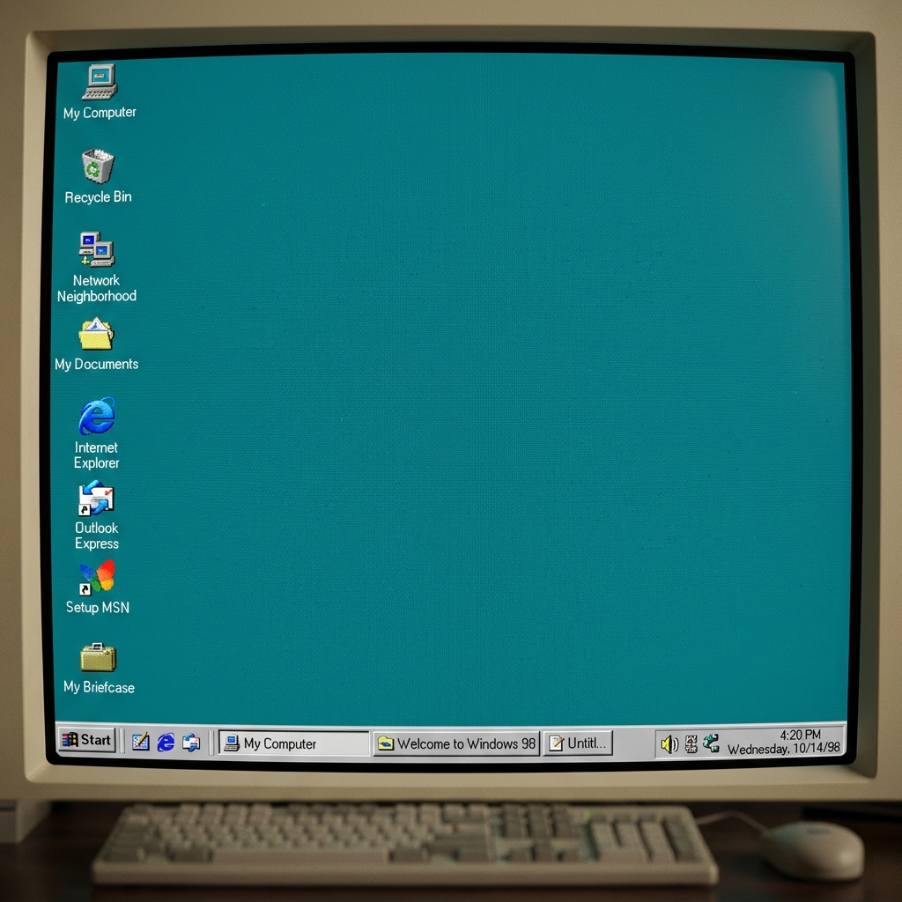

# HaYTo | Windows 98 Edition 💾

  
   
  <i>"Modern tech with a retro soul."</i>

Welcome to the nostalgic digital space of **HaYTo**. This project is a fully functional, browser-based recreation of the classic **Windows 98** interface, serving as a personal portfolio and project showcase.

---

## 🖥️ Project Overview

This site is designed to bring back the golden era of computing while showcasing modern web extensions and software developed by HaYTo. It features a desktop environment, taskbar, start menu, and draggable windows, all styled with authentic retro aesthetics.

### ✨ Key Features:
- **Authentic Retro UI**: Built with pure CSS to replicate the 1998 look and feel.
- **Multi-language Support (i18n)**: Automatically detects browser language (TR/EN) and allows manual switching.
- **Responsive Navigation**: Desktop icons and taskbar shortcuts for quick access.
- **Interactive Notepad**: A functional retro Notepad window for contact info.

---

## 🚀 Featured Extensions

| Extension | Platform | Icon |
| :--- | :--- | :---: |
| **Whatsapp To Sahibinden** | [Chrome](https://chromewebstore.google.com/detail/whatsapp-to-sahibinden/kpgemfhcbfplfinonlfolenclpjmplbd) / [Edge](https://microsoftedge.microsoft.com/addons/detail/whatsapp-to-sahibinden/kpgemfhcbfplfinonlfolenclpjmplbd) |  |
| **TabSuspender HaYTooL** | [Web Site](https://haytokoraz.github.io/TabSuspender-HaYTooL/) / [Chrome](https://chromewebstore.google.com/detail/tabsuspender-haytool/jdobamnoklijnglcdbadcbefhncmnkad) / [Edge](https://microsoftedge.microsoft.com/addons/detail/oiiaihdhfoepcipblaiggcbignahmbeg) / [GitHub](https://github.com/HaYToKoRaZ/TabSuspender-HaYTooL) |  |
| **WebTranslate HaYTooL** | [Web Site](https://haytokoraz.github.io/WebTranslate-HaYTooL/) / [Chrome (Yakında)](https://github.com/HaYToKoRaZ/WebTranslate-HaYTooL) / [Edge (Yakında)](https://github.com/HaYToKoRaZ/WebTranslate-HaYTooL) / [GitHub](https://github.com/HaYToKoRaZ/WebTranslate-HaYTooL) |  |
| **ExtensityPlus** | [Web Site](https://haytokoraz.github.io/ExtensityPlus-HaYTooL/) / [Chrome](https://chromewebstore.google.com/detail/mpcogfjfimnlfamonkfelppdcdhfhcom) / [Edge](https://microsoftedge.microsoft.com/addons/detail/dabnojjcohhbhbopbgjaaeajffagiiph) / [GitHub](https://github.com/HaYToKoRaZ/ExtensityPlus-HaYTooL) |  |
| **Cloud StartPage** | [Web Site](https://haytokoraz.github.io/HaYTooL-Cloud-StartPage/) / [Chrome](https://chromewebstore.google.com/detail/haytool-cloud-startpage/fgiompioalgpjalpmdjchlgecgdkkncn) / [Edge](https://microsoftedge.microsoft.com/addons/detail/haytool-cloud-startpage/jkefcejfnbeifclgpkfkpidoegohcchp) / [GitHub](https://github.com/HaYToKoRaZ/HaYTooL-Cloud-StartPage) |  |

---

## 💻 PC Softwares

| Software | Repository | Icon |
| :--- | :--- | :---: |
| **HaYTooL Firewall** | [Web Site](https://haytokoraz.github.io/HaYTooL-Firewall/) |  |
| **HaYTooL Weather** | [Web Site](https://haytokoraz.github.io/HaYTooL-Weather/) |  |
| **HaYTooL Youtube Download** | [Web Site](https://haytokoraz.github.io/haytool-youtube-download/) |  |
| **HaYTooL Wallpaper** | [Web Site](https://haytokoraz.github.io/HaYTooL-Wallpaper/) |  |

---

## 🛠️ Built With

- **HTML5**: Semantic structure.
- **Vanilla CSS**: Custom retro styling (no frameworks).
- **JavaScript**: Window logic, i18n, and real-time systems.

## 🔗 Connect with Me

  
  &nbsp;&nbsp;
  
  &nbsp;&nbsp;
  

---

# HaYTo | Windows 98 Sürümü 💾

**HaYTo**'nun nostaljik dijital dünyasına hoş geldiniz. Bu proje, klasik **Windows 98** arayüzünün tarayıcı tabanlı, tam işlevsel bir yeniden canlandırmasıdır; kişisel portfolyo ve proje vitrini olarak hizmet vermektedir.

## 🖥️ Proje Genel Bakışı

Bu site, HaYTo tarafından geliştirilen modern web eklentilerini ve yazılımlarını sergilerken bilişim dünyasının altın çağını geri getirmek için tasarlandı. Masaüstü ortamı, görev çubuğu, başlat menüsü ve sürüklenebilir pencereler ile tamamen orijinal retro estetiğine sahiptir.

### ✨ Öne Çıkan Özellikler:
- **Orijinal Retro Arayüz**: 1998 görünümünü yansıtmak için saf CSS ile oluşturuldu.
- **Çoklu Dil Desteği (i18n)**: Tarayıcı dilini otomatik algılar (TR/EN).
- **Duyarlı Navigasyon**: Hızlı erişim için masaüstü simgeleri ve görev çubuğu.
- **İnteraktif Not Defteri**: İletişim bilgilerine erişim sağlayan işlevsel Not Defteri.

---

## 🚀 Geliştirilen Eklentiler

| Eklenti Adı | Mağaza | İkon |
| :--- | :--- | :---: |
| **Whatsapp To Sahibinden** | [Chrome](https://chromewebstore.google.com/detail/whatsapp-to-sahibinden/kpgemfhcbfplfinonlfolenclpjmplbd) / [Edge](https://microsoftedge.microsoft.com/addons/detail/whatsapp-to-sahibinden/kpgemfhcbfplfinonlfolenclpjmplbd) |  |
| **TabSuspender HaYTooL** | [Web Sitesi](https://haytokoraz.github.io/TabSuspender-HaYTooL/) / [Edge](https://microsoftedge.microsoft.com/addons/detail/oiiaihdhfoepcipblaiggcbignahmbeg) / [GitHub](https://github.com/HaYToKoRaZ/TabSuspender-HaYTooL) |  |
| **ExtensityPlus** | [Web Sitesi](https://haytokoraz.github.io/ExtensityPlus-HaYTooL/) / [Chrome](https://chromewebstore.google.com/detail/mpcogfjfimnlfamonkfelppdcdhfhcom) / [GitHub](https://github.com/HaYToKoRaZ/ExtensityPlus-HaYTooL) |  |
| **Old School RSS** | Yakında |  |
| **Cloud StartPage** | [Web Sitesi](https://haytokoraz.github.io/HaYTooL-Cloud-StartPage/) / [Chrome](https://chromewebstore.google.com/detail/haytool-cloud-startpage/fgiompioalgpjalpmdjchlgecgdkkncn) / [Edge](https://microsoftedge.microsoft.com/addons/detail/haytool-cloud-startpage/jkefcejfnbeifclgpkfkpidoegohcchp) / [GitHub](https://github.com/HaYToKoRaZ/HaYTooL-Cloud-StartPage) |  |

---

## 💻 PC Yazılımları

| Yazılım Adı | Depo | İkon |
| :--- | :--- | :---: |
| **HaYTooL Firewall** | [Web Sitesi](https://haytokoraz.github.io/HaYTooL-Firewall/) |  |
| **HaYTooL Weather** | [Web Sitesi](https://haytokoraz.github.io/HaYTooL-Weather/) |  |
| **HaYTooL Youtube Download** | [Web Sitesi](https://haytokoraz.github.io/haytool-youtube-download/) |  |
| **HaYTooL Wallpaper** | [Web Sitesi](https://haytokoraz.github.io/HaYTooL-Wallpaper/) |  |

---

## 🔗 İletişim Kanalları

  
  &nbsp;&nbsp;
  
  &nbsp;&nbsp;
  

---
*SYSTEM_READY // 1980*
